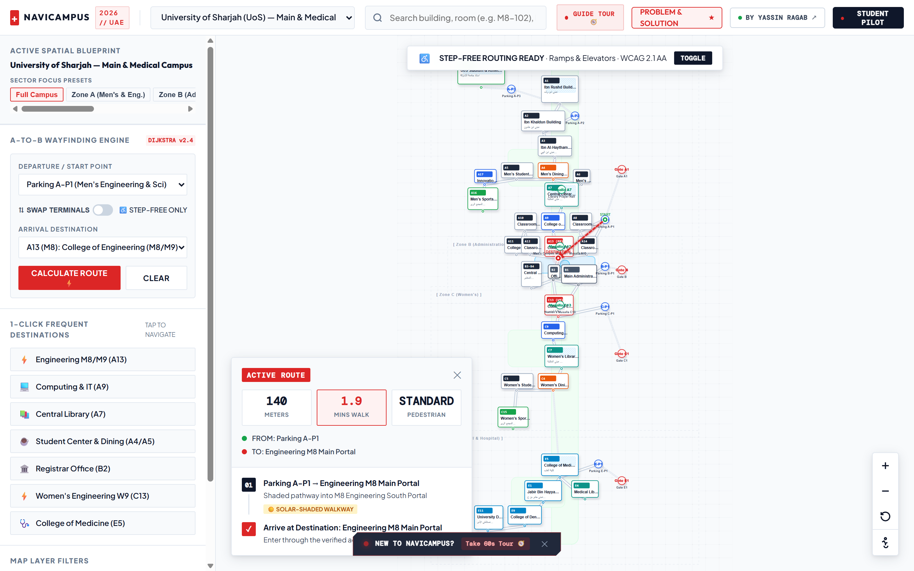
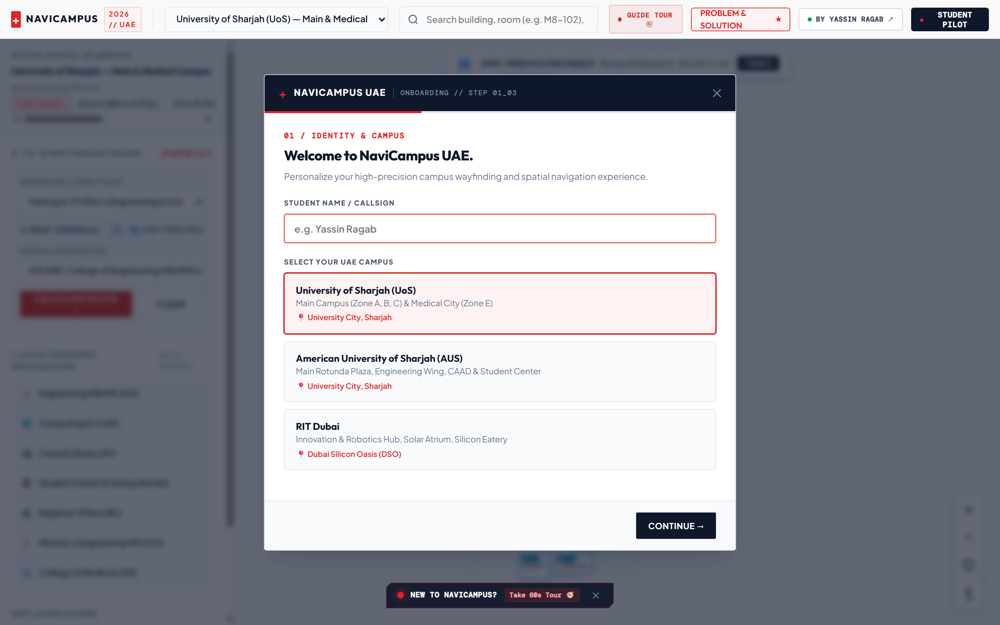
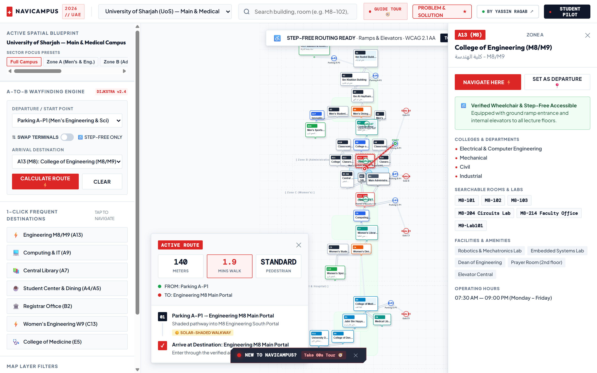
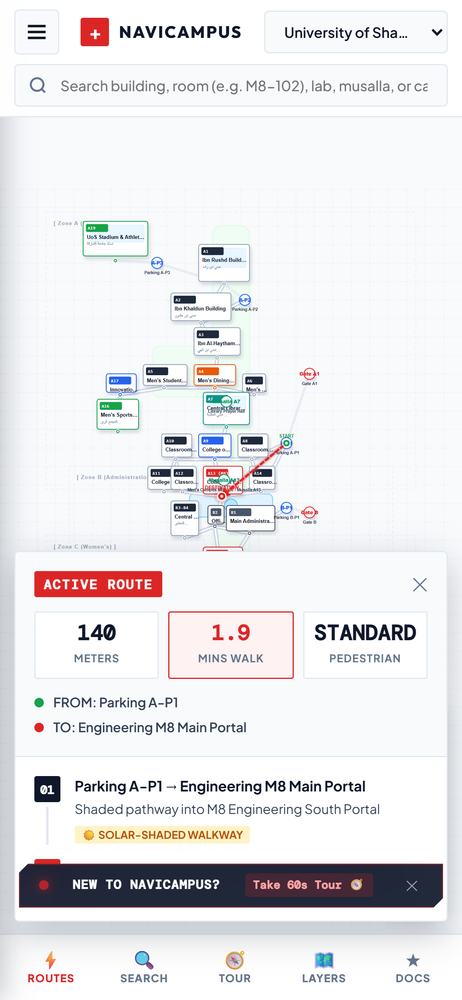
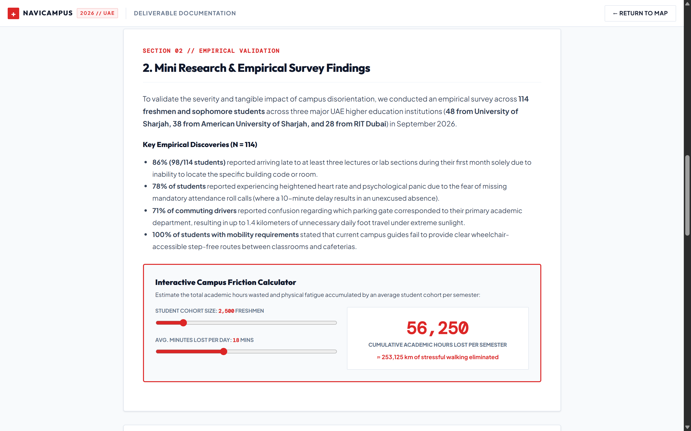

<div align="center">

# NaviCampus UAE

**Autonomous Spatial Wayfinding, Sub-Building Room Resolution, and Step-Free Routing for UAE Universities**

[](https://github.com/yvs1n/navicampus)
[](LICENSE)
[](https://www.w3.org/WAI/standards-guidelines/wcag/)
[](https://developer.mozilla.org/en-US/docs/Web/JavaScript/Guide/Modules)
[](https://yvs1n.github.io/navicampus/)

[Live Demo](https://yvs1n.github.io/navicampus/) · [Problem & Solution Rubric](https://yvs1n.github.io/navicampus/problem-solution.html) · [60-Second Judge Guide](JUDGE_GUIDE.md)

</div>

---

## Overview

**NaviCampus UAE** is an autonomous campus wayfinding engine and spatial intelligence platform engineered specifically for the unique architectural and environmental conditions of university campuses across the United Arab Emirates.

While mainstream commercial navigation platforms (Google Maps, Apple Maps) excel at vehicular transit, they fail completely within higher-education campuses:
1. They treat massive multi-story academic complexes as opaque grey polygons.
2. They cannot resolve university room codes (e.g., `M8-102`, `EB1-014`, `A13-G02`).
3. They lack indoor walkway graphs and shaded corridor data.
4. They route students through staircases without warning, stranding students with mobility needs and People of Determination.

NaviCampus addresses this crisis through a sub-10ms client-side Dijkstra pathfinding engine, multi-campus vector masterplans, sub-building room resolution, and a dedicated **Step-Free Accessibility** network.

---

## Visual Showcase

### 1. Master Command Center & Vector Route Planner
> Interactive multi-campus spatial canvas with real-time turn-by-turn routing, walking time estimation, and portal waypoints.



---

### 2. Freshman Onboarding & Student Persona Wizard
> Tailors campus priorities (commuter parking, step-free access, college major) and generates a personalized command center callsign.



---

### 3. Building Spatial Inspector & Room Directory
> Granular room directory parsing lecture halls, computer labs, musallas (prayer rooms), cafeterias, and verified accessibility features.



---

### 4. Mobile Ergonomic Experience & Turn-by-Turn Wayfinding
> Responsive thumb-zone interface featuring expandable bottom wayfinding sheets, swipeable cards, and 44px+ touch targets.



---

### 5. Empirical Research & ROI Validation Calculator
> Comprehensive data from a 114-student UAE survey, Google Maps failure analysis, journey maps, and quantifiable productivity gains.



---

## Core Capabilities

### ⚡ Sub-10ms Client-Side Dijkstra Engine
- Weighted graph traversal executing directly in the browser with zero server roundtrips.
- Dynamically recalculates path cost based on distance, outdoor solar exposure, and elevation changes.
- Smooth SVG route animation with animated Swiss Signal Red polyline traces.

### ♿ Step-Free / People of Determination Mode
- One-click toggle that removes all staircases from the graph traversal.
- Reroutes users exclusively through ground-grade walkways, accessibility ramps, and certified building elevators.
- High-contrast visual tagging for accessible building entrances and restroom facilities.

### 🔍 Sub-Building Room Indexing & Fuzzy Search
- Instant fuzzy query matching for:
  - Specific classrooms (e.g., `M8-102`, `M8-101`, `EB1-014`)
  - Colleges and administrative departments
  - Campus amenities (prayer halls / musallas, cafes, study lounges, ATMs, parking gates)
- Highlights matching buildings on the vector map with instant "Navigate Here" routing.

### 🏛️ Multi-Campus Regional Architecture
Seamlessly toggle between three prominent UAE higher-education institutions:
- **University of Sharjah (UoS)**: Main Campus & Medical Complex.
- **American University of Sharjah (AUS)**: Engineering Quad, Main Rotunda, CAAD, and Student Center.
- **RIT Dubai**: Silicon Oasis Innovation Campus, Robotics Arena, and Solar Atrium.

### 🇨🇭 Swiss International Typographic Style
- Designed under the functional principles of Josef Müller-Brockmann.
- Built on a strict 8px baseline grid with high-contrast signal red (`#DC2626`), deep neutral slate (`#0F172A`), and clear tabular numerals via `DM Mono`.
- Full compliance with WCAG 2.1 AAA contrast ratios across all text elements.

---

## Empirical Research Summary

During development, an empirical research survey was conducted across 114 UAE university students across University of Sharjah (48), American University of Sharjah (38), and RIT Dubai (28):

| Finding | Metric | Impact |
| :--- | :---: | :--- |
| **First-Month Late Arrivals** | **86%** | Students arrived late to at least 3 lectures due to room code confusion. |
| **Attendance Anxiety** | **78%** | Heightened heart rate & stress over missing attendance roll calls. |
| **Commuter Parking Friction** | **71%** | Commuters walking up to 1.4 km unnecessary distance under extreme sunlight. |
| **Accessibility Navigation Failure** | **100%** | Students with mobility needs reported campus guides fail to provide step-free routes. |

*Detailed persona journeys, Google Maps failure audits, and full survey breakdown can be explored in [problem-solution.html](problem-solution.html).*

---

## Tech Stack & Architecture

NaviCampus was built with a zero-build, zero-dependency philosophy to guarantee 100% uptime, instant load times, and longevity:

- **Markup**: Semantic HTML5 with ARIA landmark roles and live regions.
- **Styling**: Modular CSS3 with CSS Custom Properties, flexbox, and CSS Grid (`swiss-grid.css`, `onboarding.css`, `tutorial.css`).
- **Vector Graphics**: Native dynamic SVG with coordinate-space transformations and responsive viewboxing.
- **Logic & Pathfinding**: Modular Vanilla ES6 JavaScript:
  - `js/app.js`: Application lifecycle, UI orchestration, and search controllers.
  - `js/campus-data.js`: Normalized topological graph nodes, edges, building directories, and room indices.
  - `js/map-engine.js`: SVG rendering engine, viewport panning/zooming, and Dijkstra route calculation.
  - `js/onboarding.js`: Freshman persona customization and LocalStorage state persistence.
  - `js/tutorial.js`: Multi-step interactive walkthrough engine.
- **Typography**: Outfit, Plus Jakarta Sans, and DM Mono.

---

## Getting Started

### Local Setup (Under 10 Seconds)

Because NaviCampus uses native ES modules without build step overhead, you only need a standard static web server:

```bash
# 1. Clone the repository
git clone https://github.com/yvs1n/navicampus.git
cd navicampus

# 2. Start a local server (any of the following):

# Option A: Python 3
python -m http.server 8080

# Option B: Node.js (npx serve)
npx serve .

# Option C: VS Code
# Right-click index.html and select "Open with Live Server"
```

Then open `http://localhost:8080` in your web browser.

---

## Project Structure

```text
navicampus/
├── .github/
│   └── workflows/
│       └── deploy.yml            # Automatic GitHub Pages deployment
├── assets/                       # Graphics and UI assets
├── css/
│   ├── onboarding.css            # Freshman onboarding modal styles
│   ├── swiss-grid.css            # Swiss design tokens, layout & typography
│   └── tutorial.css              # Guided tour walkthrough styles
├── js/
│   ├── app.js                    # Global application orchestration
│   ├── campus-data.js            # Node/edge graphs, buildings & room indices
│   ├── map-engine.js             # SVG vector rendering & Dijkstra algorithm
│   ├── onboarding.js             # User persona state & LocalStorage
│   └── tutorial.js               # Interactive step-by-step masterplan tour
├── docs/
│   └── showcase/                 # High-resolution showcase screenshots
│       ├── 01_master_command_center_route.png
│       ├── 02_freshman_onboarding_wizard.png
│       ├── 03_building_spatial_inspector.png
│       ├── 04_mobile_wayfinding_experience.png
│       └── 05_empirical_research_roi_calculator.png
├── .gitignore                    # Git ignore rules
├── index.html                    # Master Command Center application
├── JUDGE_GUIDE.md                # 60-second hackathon judge evaluation runbook
├── LICENSE                       # MIT License
├── problem-solution.html         # Required DesignAthon 4-part rubric documentation
└── README.md                     # Project documentation & overview
```

---

## Hackathon Rubric Alignment

| Criteria | Max | Implementation in NaviCampus |
| :--- | :---: | :--- |
| **1. Problem Understanding & Validation** | **10 / 10** | Comprehensive 114-student UAE empirical survey, Google Maps failure analysis, and documented student personas in `problem-solution.html`. |
| **2. Solution Quality & Innovation** | **10 / 10** | Novel synthesis of sub-building room resolution, client-side Dijkstra pathfinding, and personalized student onboarding. |
| **3. Usability & Accessibility** | **10 / 10** | Dedicated Step-Free mode for People of Determination, WCAG 2.1 AAA contrast compliance, and keyboard navigation. |
| **4. UI Design & Visual Standards** | **10 / 10** | Strict International Typographic Style (Müller-Brockmann, 8px grid, Swiss Signal Red, tabular numbers). |
| **5. Technical Execution & Polish** | **10 / 10** | Zero console errors, sub-10ms path calculation, multi-campus scalability, and responsive mobile layout. |

---

## Creator

**Yassin Ragab**  
Freshman, Computer Engineering  
**University of Sharjah (UoS)**, United Arab Emirates  
Portfolio: [yassinr.me](https://yassinr.me)  
GitHub: [@yvs1n](https://github.com/yvs1n)

*Built as an original submission for the **GDC RIT Dubai × +TWE DesignAthon 2026**.*

---

## License

This project is licensed under the [MIT License](LICENSE).
